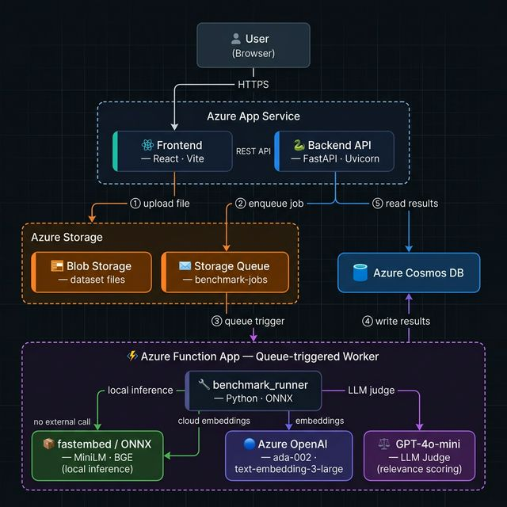
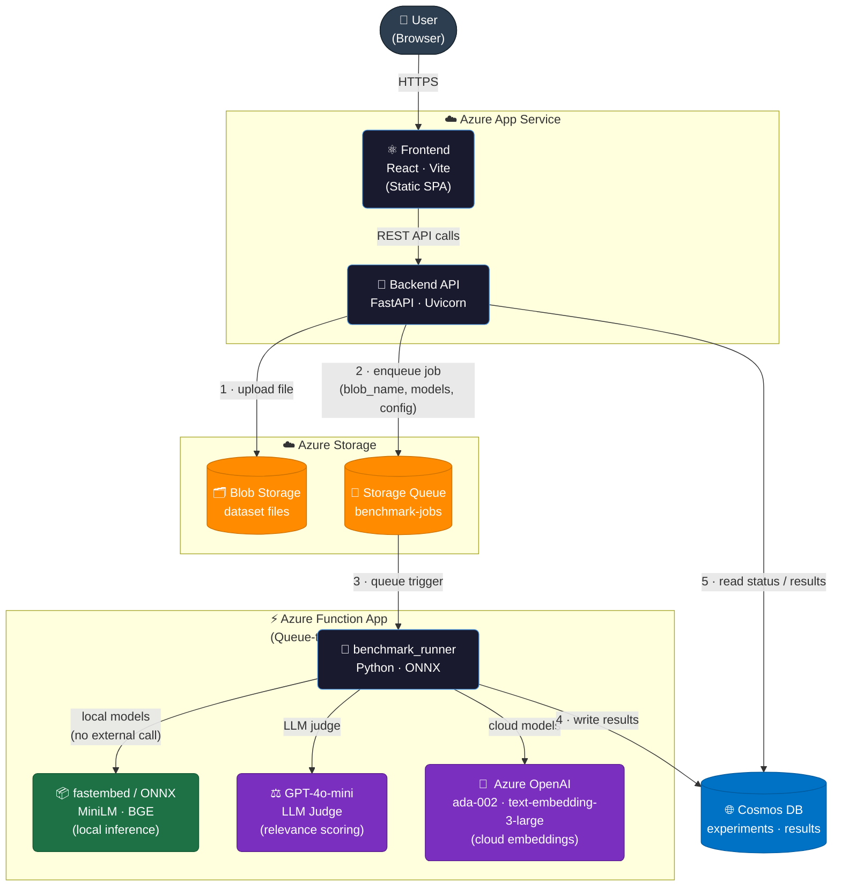

# System Architecture

> **EmbedMatch – Embedding Model Selection Platform**
> Final architecture as built for the Cloud Computing course project (POLIMI, 2025–26).

---

## Diagram Source (Mermaid)

---

## Component Responsibilities

| Component | Technology | Hosting |
|---|---|---|
| **Frontend** | React 19, Vite, TailwindCSS v4, shadcn/ui | Azure App Service (Linux) |
| **Backend API** | FastAPI, Python 3.12, Uvicorn | Azure App Service (Linux) |
| **File Storage** | Azure Blob Storage | Azure Storage Account |
| **Job Queue** | Azure Storage Queue (`benchmark-jobs`) | Azure Storage Account |
| **Benchmark Worker** | Azure Function App (Python, queue-triggered) | Azure Functions Consumption Plan |
| **Cloud Embeddings** | Azure OpenAI – `ada-002`, `text-embedding-3-large` | Azure OpenAI Service |
| **Local Embeddings** | fastembed / ONNX – `MiniLM-L6-v2`, `BGE-small-en-v1.5` | In-process (no external call) |
| **LLM Judge** | Azure OpenAI – `GPT-4o-mini` | Azure OpenAI Service |
| **Results Store** | Azure Cosmos DB (NoSQL) | Azure Cosmos DB |

## Data Flow

1. User uploads a CSV / JSONL dataset via the React frontend.
2. The backend stores the file in **Blob Storage** and enqueues a job message to **Storage Queue**.
3. The **Azure Function App** dequeues the job (queue trigger, invisible timeout 5 min).
4. The function runs embeddings with **both** cloud models (Azure OpenAI) and local ONNX models (fastembed).
5. A **GPT-4o-mini LLM judge** scores top-k retrieval results for semantic relevance (1–10).
6. Results are written to **Cosmos DB** (per-model metrics + judge scores).
7. The frontend polls the backend every 3 s; once `status === "completed"` the results dashboard renders.
